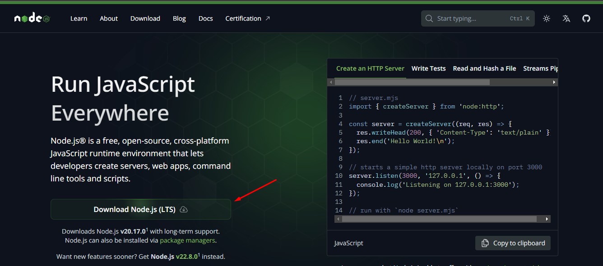

## Requisitos
* Node

## Instruções de instalação
Esta aplicação utiliza o **Node** para executar códigos Javascript fora do navegador. Confira abaixo as instruções para a instalação do **Node**:

1. Acesse o [site](https://nodejs.org/en) para realizar o download da versão LTS:



2. Prossiga com a instalação normalmente.

3. Para verificar o sucesso da instalação, abra o terminal e execute o comando:
```bash
node -v
```
